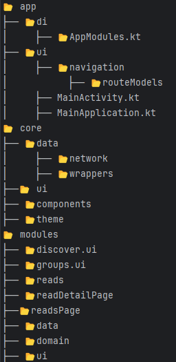

# myRead(Kotlin training app)

## Description
Project created to practice patterns and architectures for Android Kotlin development, applying concepts of:
- Clean architecture
- Single Activity Pattern
- Dependency injection
- Jetpack Compose
- Unit Testing
## **Functionalities**

-   **Navigation**: Based on Single Activity Pattern using Compose Navigation.
-   **State Management**: Use MVI Pattern with FlowStates.
-   **API Integration**: Rest API with Retrofit2 and JSON Serializable support.
-   **Modularization**: Modular structure that facilitates project maintenance and growth.
-   **DI**: Koin.
-   **Testig**: Unit and Integration tests with Robolectric, Mockk and JUnit.

## Structure

## Dependencies
```kotlin
// Serialização
implementation "org.jetbrains.kotlinx:kotlinx-serialization-json:$serialization_version"

// Retrofit
implementation "com.squareup.retrofit2:retrofit:$retrofit_version"
implementation "com.squareup.retrofit2:converter-gson:$retrofit_gson_version"

// OkHttp
implementation "com.squareup.okhttp3:okhttp:$okhttp_version"
implementation "com.squareup.okhttp3:logging-interceptor:$logging_interceptor_version"
testImplementation "com.squareup.okhttp3:mockwebserver:$mockwebserver_version"

// Koin
implementation "io.insert-koin:koin-bom:$koin_bom_version"
implementation "io.insert-koin:koin-androidx-compose:$koin_compose_version"
implementation "io.insert-koin:koin-androidx-compose-navigation:$koin_navigation_version"
testImplementation "io.insert-koin:koin-test:$koin_test_version"
testImplementation "io.insert-koin:koin-test-junit4:$koin_junit4_version"

// Gson
implementation "com.google.code.gson:gson:$gson_version"

// Testes
testImplementation "org.robolectric:robolectric:$roboletric_version"
testImplementation "io.mockk:mockk:$mockk_version"
testImplementation "org.mockito:mockito-core:$mockito_version"
testImplementation "org.slf4j:slf4j-simple:$slf4j_version"
testImplementation "org.jetbrains.kotlinx:kotlinx-coroutines-test:$coroutines_test_version"
implementation "org.jetbrains.kotlinx:kotlinx-coroutines-core:$coroutines_core_version"
```
## **Instalação**

1.  Clone o repositório:
```
git clone https://github.com/seu-usuario/seu-repositorio.git
cd seu-repositorio
```    
2.  Abra o projeto no Android Studio.
3.  Configure o ambiente:
    -   Certifique-se de adicionar o URL base no módulo de rede, como segue:
   ```
    single { getApiModules("https://run.mocky.io/v3/") }
  ``` 
4.  Execute o projeto em um dispositivo ou emulador.
